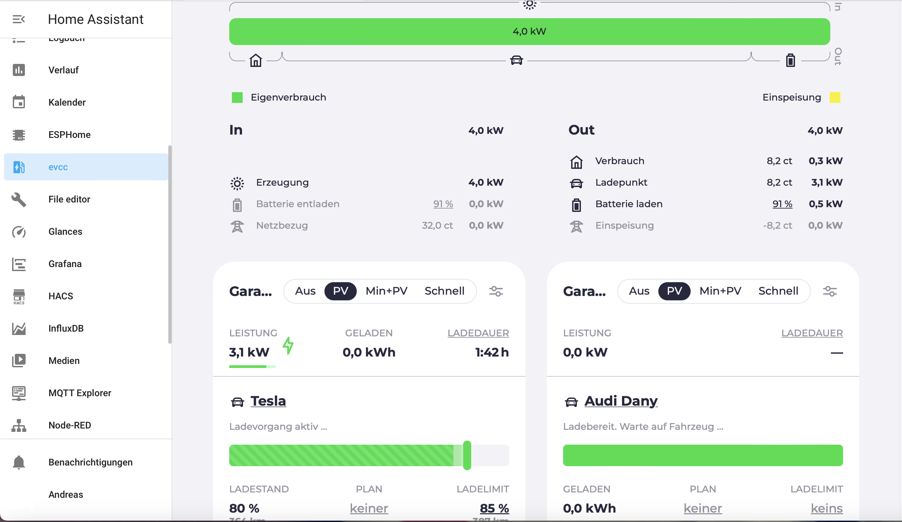

twc3simulator_v2 (Tesla Wall Box 3 Simulator) für EVCC 
(auch für HomeAssistent Addon)

 Version: 0.2
  26.06.2024
   - Ladestrom und Ladespannung werden von einem Shelly 1pm abgefragt und simuliert
     
  in Arbeit:
   - Anzeige der geladenen Wh des Ladevorganges   

Dieses Programm simuliert die API-Ausgabe einer Tesla Wallbox 3.

Es fälscht im Grunde nur die Ausgabe, während es Informationen von einem Shelly 1pm-Gerät verwendet, um den Strom zu füllen.

Ich benutze dies als Workaround, um evcc mit dem mobilen Ladegerät arbeiten zu lassen, da evcc ein richtiges Ladegerät benötigt. Die twc3-Vorlage ist etwas Besonderes, weil sie evcc die eigene API von Tesla verwenden lässt, um das aktuelle Niveau zu starten/zu stoppen und anzupassen.

## requirements

- Shelly 1pm outlet to grep the current from. - Something like https://amzn.eu/d/0alZo2Gv

## Installation

via docker:

    docker run --name twc3simulator_v2 -p 80:80 -e SHELLY_IP=192.168.178.59 thekey82/twc3simulator_v2

Wobei SHELLY_IP die IP des Shelly-Geräts ist, von dem die aktuellen Informationen stammen sollten.

Oder als Teil Ihres evcc, so dass Sie über Port 80 darauf zugreifen können.

    services:
    twc3simv2:
      container_name: twc3simv2
      image: thekey82/twc3simulator_v2
      environment:
        - "SHELLY_IP=192.168.178.59"
      restart: unless-stopped
      
Vollständiges Beispiel im Beispielordner

for tweaking:

Klonen Sie es zuerst auf die Maschine, auf der Sie es ausführen möchten

    git clone https://github.com/thekey82/twc3simulator_v2.git

## Stellen Sie die richtige IP Ihres Shelly-Geräts ein

    cd twc3simulator_v2
    
Bearbeiten Sie dafür das Skript und legen Sie die richtige IP-Adresse fest

    vim app/main.py

Oder setzen Sie die IP als Envirnment "var".
    
## run it

Um es nativ auszuführen, müssen Sie zuerst die Anforderungen mit pip oder Ihrem Paketmanager installieren

native:

    pip3 install -r requirements.txt
    sudo uvicorn app.main:app --reload --host 0.0.0.0 --port 80

   
## validate

Wenn es richtig läuft, sollten Sie etwas zurückbekommen, wenn Sie es sich ansehen

http://<ip>/api/1/vitals
